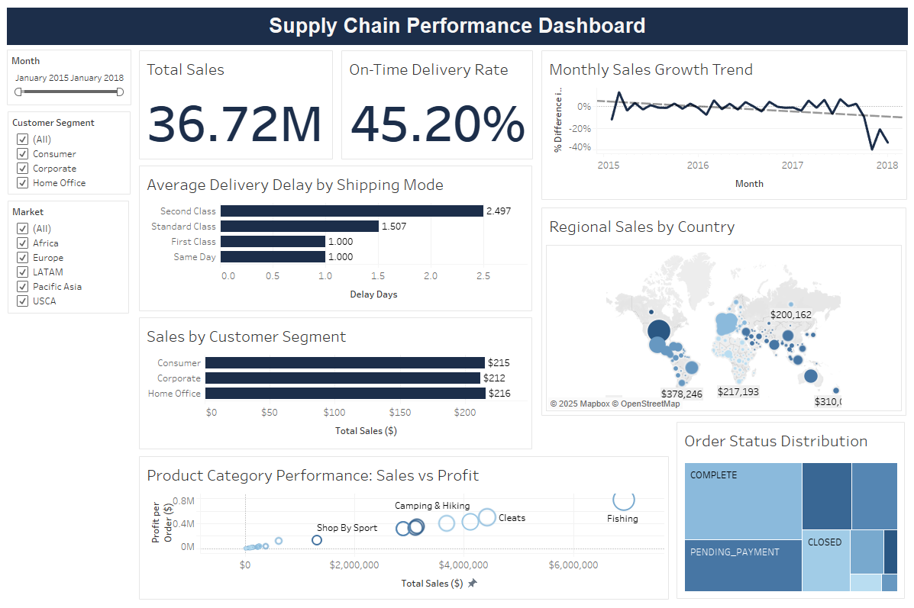

# Supply Chain Analysis Project

## Problem Statement
DataCo Global Supply Chain Company was experiencing challenges in understanding their operational performance and customer behavior across global markets. They needed clear insights into delivery performance, sales patterns, and customer segmentation to improve decision-making and optimize their supply chain operations.

## Business Objective
To analyze the company's supply chain data and create an interactive dashboard that provides actionable insights into delivery performance, sales distribution, customer behavior, and product performance across different regions.

## My Approach
1. **Data Cleaning & Preparation**: Started by cleaning the raw dataset, removing unnecessary columns, handling missing values, and standardizing data formats
2. **Exploratory Data Analysis**: Examined key metrics to understand patterns and relationships in the data
3. **KPI Development**: Created 8 essential business metrics to track performance
4. **Data Visualization**: Built an interactive Tableau dashboard to present findings clearly

## Tools and Techniques Used
- **Python**: For data cleaning, preprocessing, and initial analysis using pandas and numpy
- **Tableau**: For creating interactive visualizations and dashboards
- **Data Cleaning**: Handling missing values, standardizing formats, removing duplicates
- **Data Visualization**: Creating charts, graphs, and maps to present insights

## Key Performance Indicators (KPIs)
1. **On-Time Delivery Rate**: Percentage of orders delivered on time
2. **Average Delivery Delay**: How many days late shipments are by shipping type
3. **Total Sales**: Overall company revenue
4. **Sales by Customer Segment**: Revenue from different customer types
5. **Order Status Distribution**: Current status of all orders
6. **Regional Sales**: Sales performance by country
7. **Product Category Performance**: Sales and profit by product type
8. **Monthly Sales Growth**: How sales are changing over time

## Dashboard

## Key Insights

### Insight 1: Delivery Performance Crisis
**Finding**: Only 45.2% of orders are delivered on time, and Second Class shipping has the worst delays at 2.5 days average.

**Business Impact**: Poor delivery makes customers unhappy and likely explains why sales are dropping. When deliveries are late, customers may delay payments or stop ordering.

**Recommendations**:
- Focus on improving Second Class shipping performance first
- Set up better delivery tracking and communication with customers
- Review shipping partner contracts and performance

### Insight 2: Major Sales Decline
**Finding**: Sales dropped 39.5% in November 2017 and 33.1% in January 2018, showing a serious business decline.

**Business Impact**: This represents millions in lost revenue and could threaten the company's survival if not fixed quickly.

**Recommendations**:
- Investigate what caused the sudden sales drops
- Launch customer retention campaigns to win back business
- Offer limited-time promotions to rebuild sales

### Insight 3: Customer Concentration Risk
**Finding**: Consumer customers make up 52% of all sales ($19.1M of $36.7M total), while Corporate customers are 30% and Home Office are 18%.

**Business Impact**: Relying too much on one customer type is risky. If Consumer spending drops, the business could be in trouble.

**Recommendations**:
- Create special programs to grow Corporate and Home Office segments
- Develop different marketing strategies for each customer type
- Offer business-specific benefits for Corporate customers

### Insight 4: Payment and Fraud Issues
**Finding**: There are 39,817 orders waiting for payment and 4,061 suspected fraud cases.

**Business Impact**: This represents significant revenue that hasn't been collected and potential losses from fraud.

**Recommendations**:
- Improve payment reminder systems for pending orders
- Strengthen fraud detection before orders ship
- Review the order verification process

### Insight 5: Product Performance Variation
**Finding**: Fishing products generate the most sales ($6.9M) and profit ($776K), while many other categories have much lower performance.

**Business Impact**: Some products are much more profitable than others, suggesting the company could focus on what works best.

**Recommendations**:
- Increase marketing and inventory for high-performing categories like Fishing
- Review and possibly reduce low-performing categories
- Analyze why some products sell better than others

## Summary
This analysis shows that the company's main problems are poor delivery performance and declining sales. Fixing the delivery issues should help improve customer satisfaction and stop the sales decline. The company should also work on diversifying their customer base and focusing on their most profitable products.
